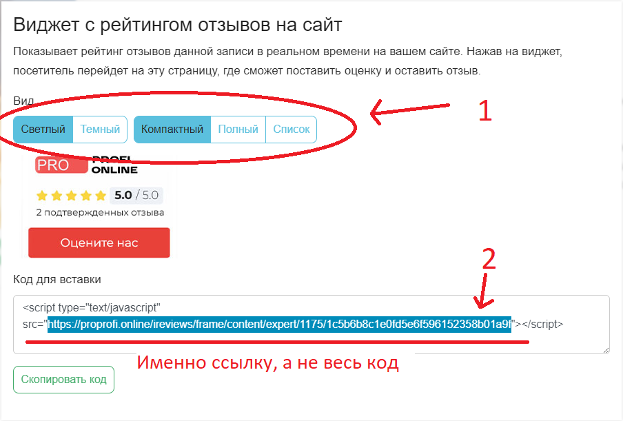
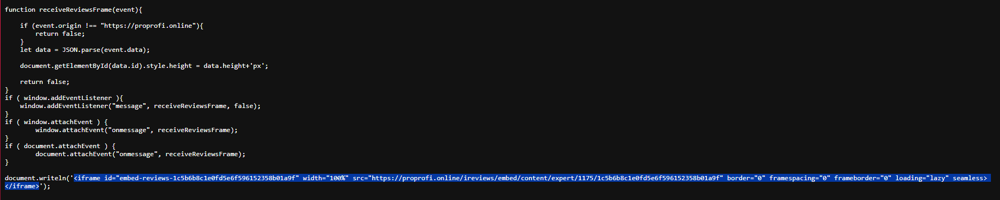
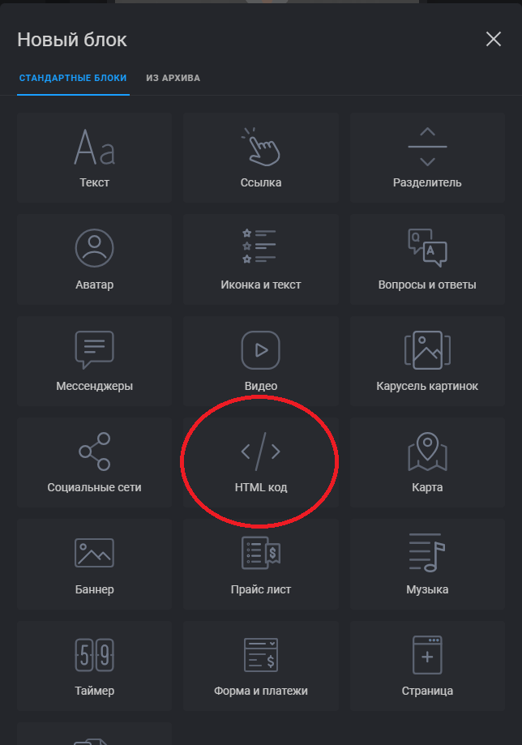
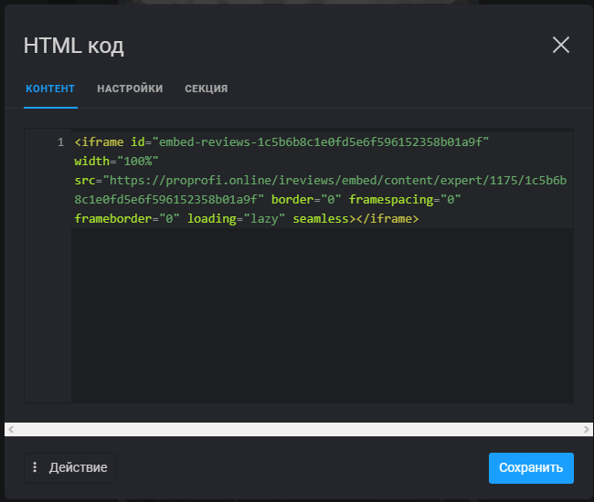
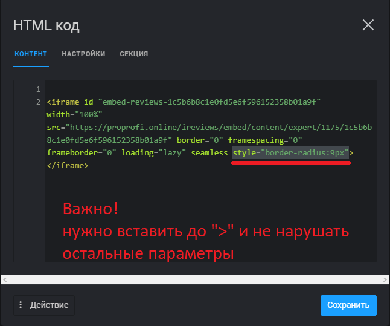

# Инструкция по вставке блока ***ProProfi*** в ***taplink***

### Переходим на страницу ProProfi, кликаем на кнопку "код для встраивания"

### В появившемся окне настраиваем параметры, после чего копируем ссылку и переходим по ней.

### В открывшемся окне копируем фрейм из последней строки 
### (что бы начиналось с **<iframe** ... и заканчивалось ... **/iframe>**)

### В **taplink** создаем новый блок "html-код"

### Скопированный код вставляем в вкладку "контент" и сохраняем.

### Можно скруглить углы, вставив строку ***style="border-radius:9px"*** в фрейм

